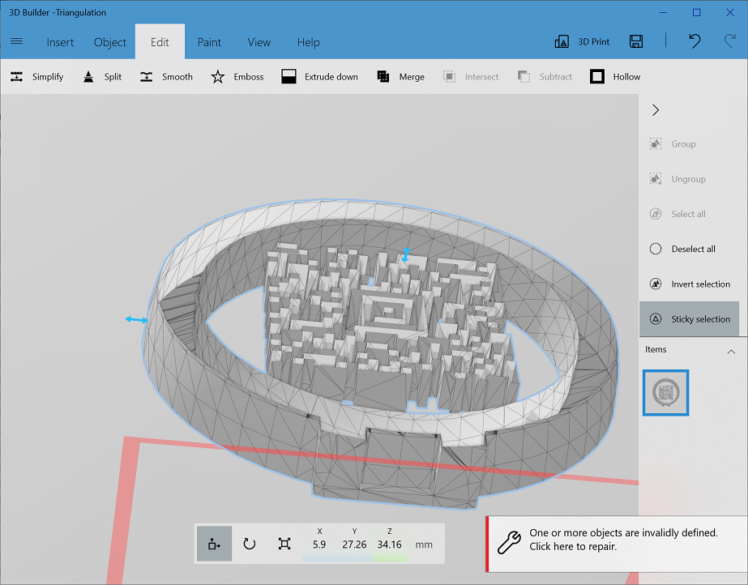
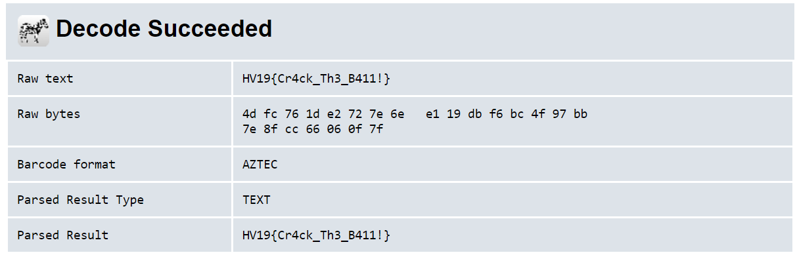

# Day 02: HV19.02 Triangulation
For this challenge we got an .stl file, wich holds a 3D object, in this case a big christmas ball ornament. As I didn't want to install blender and the countless online STL viewers couldn't edit the ornament to peek inside, I used 3D Builder, a tool that comes with Windows 10 and which worked reasonably well.  
I used the "split" function to cut off the top and bottom parts of the ornament to reveal the 2D barcode hidden inside:  

  

I then took a screenshot looking straight down on the structure, opened it in Gimp and applied thresholding to convert it into a relatively clean 2D barcode:  

  

Barcode enthusiasts will quickly recognize this as an Aztec code. I used the [ZXing online decoder](https://zxing.org/w/decode.jspx) to read the flag:  

  
